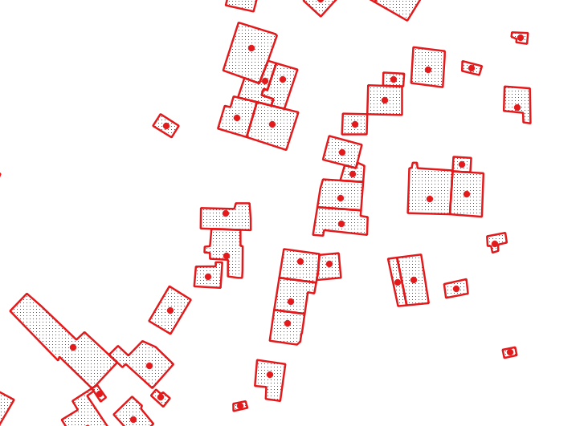
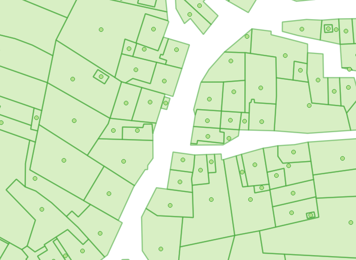
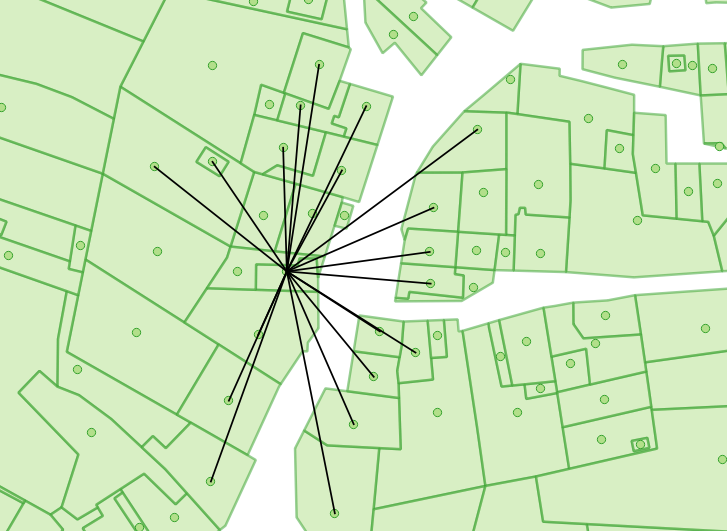

# Kad_buildings

Ce programme permet de charger les données du parcellaire cadastral dans une banque
de données `spatialite`.

## t02_agdp_buildings.sql

Ce query permet de rassembler les couches de bâtiments gérées par les régions et par le cadastre (transfert vers les régions).

Un `id_building` est calculé. 



## t02_agdp_parcels.sql

Ce query rassemble les données des 3 régions (`Bpn_CaPa_WAL`, `Bpn_CaPa_BXL` et `Bpn_CaPa_VLA`) en une seule table `t02_agdp_parcels`. Un `pointOnSurface` est calculé pour chaque parcelle. 

## t03_agdp_buildings2parcels.sql

Liens entre bâtiments et parcelles.

Variables:
 - `id_building`
 - `capakey`
 - `fl_building_within_parcel`: le bâtiment est-il inclus dans la parcelle
 - `ms_distance_building2parcelExteriorRing`
 - `ms_area_building`

## t04_agdp_parcels.sql

Permet de rajouter ces concepts à `t02_agdp_parcels`:
 - `fl_parcel_with_building`: 1 si un bâtiment se trouve sur la parcelle; 0 sinon
 - `ms_countOf_buildings`: le nombre de bâtiments sur la parcelle
 - `ms_area_buildings_total`: surface totale occupée par les parcelles




## t05_parcels_within_parcels.sql

Permet d'identifier les parcelles qui sont incluses (st_within) dans d'autres parcelles:
 - `capakey_container`: capakey du conteur
 - `capakey_content`: capakey du contenu
 - `ms_area_buildings_total`
 
Nous avons ```st_within(content.geometry,st_makePolygon(st_exteriorRing(container.geometry)))```sql.

## t06_parcels_connections_parcel.sql

Tables de liens entre parcelles. Pour que deux parcelles soient liées, il faut que ces conditions soient respectées:
 - les deux parcelles doivent être bâties 
 - la surface des bâtiments doit être de 50 m² pour chaque parcelle
 - les parcelles doivent être distante de moins de `distance` mètres (`distance` est un paramètre fixé dans config.py) - attention: on parle bien de distance entre parcelle et pas de distances entre centroides de parcelles.

Les variables suivantes sont calculées et ajoutées à la table `t06_parcels_connections`:
 - `ms_distance`: distance entre les deux parcelles; si ms_distance=0, alors les deux parcelles se touchent
 - `fl_intersects`: 1 si les parcelles se touchent; 0 sinon
 - `geometry`: ligne entre les 2 centroides (pointOnSurface) des parcelles

Deux remarques importantes:
> En général, ``st_distance(geometry)>ms_distance```sql car la distance entre deux parcelles est en général plus petite que la distance entre les centroides. Par exemple: deux parcelles qui se touchent auront une ms_distance=0 mais la st_distance(geometry) sera > 0 (à moins que le lien ne lie la parcelle à elle-même).

> Cette table contient plus de 1 milliard de lignes !!!! La banque de données pourra faire plus de 40 GB.


